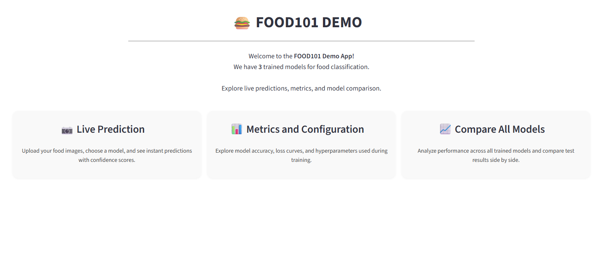
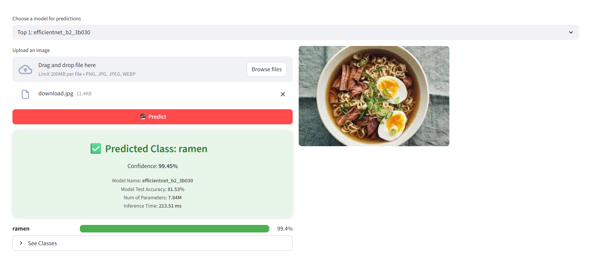
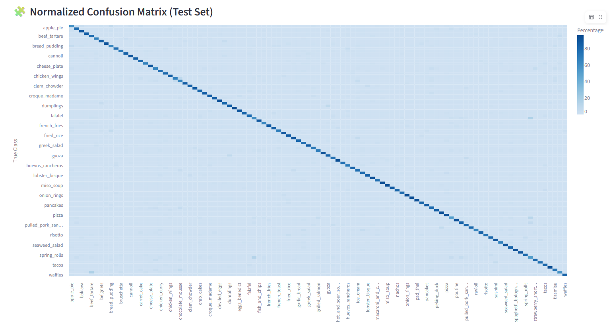
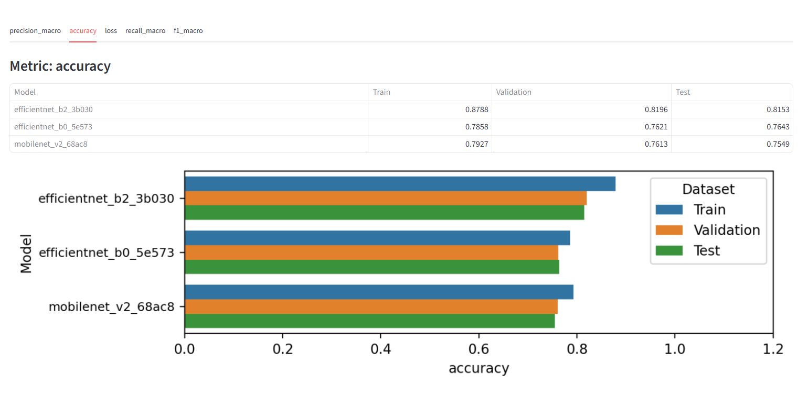

# Food101

A project for training and evaluating food classification models using **PyTorch**, **MLflow**,  **Hydra** and **Streamlit**.

This project demonstrates a full **MLOps pipeline**: from automated data preparation, training, experiment tracking, and model selection, to testing and deployment of a live demo. All stages are designed to **maximize reproducibility and automation**, allowing you to run experiments, evaluate results, and deploy models with minimal manual intervention.

> This project is inspired by the course [PyTorch for Deep Learning Bootcamp](https://www.udemy.com/course/pytorch-for-deep-learning/) by **Daniel Bourke** and **Andrei Neagoie**.


> **Note:** The pipeline is compatible with **any image classification dataset** that follows the same folder structure as `data/dataset/` (i.e., `train/`, `val/`, and `test/` folders, each containing one subfolder per class with images inside). You can replace the Food101 data with your own dataset as long as you keep this structure.

---
## 💻 Check Out the Live App
  Click [here](https://food101-mlops-pipeline-kz9xtkxx4n7mdggvdrebbc.streamlit.app/#live-prediction) to see the app in action.

## 🖼️ App Screenshots

Below are some screenshots of the app in action:

<h3 align="center">📸 App Screenshots</h3>

<p align="center">
  
  
</p>

<p align="center">
  
  
</p>


---

## 🎬 Video Demo

Watch a 10-minute walkthrough of the full pipeline and app usage:

[](https://www.youtube.com/watch?v=MXsRl4Iy6AA)

Or click here: [Video Demo on YouTube](https://www.youtube.com/watch?v=MXsRl4Iy6AA)

---

## 🚀 How to Use

You can use this project in **two ways**:

---

### Option 1: Run Only the Demo App

If you just want to try the app with already trained models (no need to run the full pipeline):

1. **Clone the repository and install dependencies:**

    ```bash
    git clone https://github.com/tu_usuario/food101Mini.git
    cd food101Mini
    conda create -n food101 python=3.10
    conda activate food101
    pip install --upgrade pip
    pip install -r requirements.txt
    ```

2. **Make sure you have the trained models available locally.**

    The folder `selected_models/` must exist on your machine. We included three trained models that can be used for predictions in the whole Food101 dataset.

3. **Launch the demo app:**

    ```bash
    make demo
    ```
    or
    ```bash
    streamlit run app.py
    ```

---

### Option 2: Full MLOps Pipeline (Reproducible Training & Evaluation)

Run the entire pipeline from data preparation to model selection and testing using the provided `makefile` commands.

#### **Step-by-step Pipeline**

| Command              | Description                          |
|----------------------|--------------------------------------|
| `make prepare`       | Prepare the dataset                  |
| `make experiments`   | Run all experiments                  |
| `make select`        | Select top models                    |
| `make test`          | Test selected models                 |
| `make demo`          | Launch Streamlit demo (if available) |
| `make clean`         | Remove outputs and logs              |
| `make ui`            | Launch MLflow UI                     |
| `make help`          | Show all available commands          |

**Example usage:**

```bash
make prepare
make experiments
make select
make test
make demo
```

> This makes it much easier to run the full pipeline without typing long commands.

---

### 📑 Configuration-driven Workflow

The pipeline is **highly configurable** via YAML files in the `conf/` folder.  
You can control every stage of the workflow, including advanced training features:

- **Experiments (`conf/experiments.yaml`):**
  - **Model selection:** Choose architectures, pretrained weights, and number of classes.
  - **Train:** Set learning rate, batch size, optimizer, epochs, and more.
  - **Schedulers:**  
    Use learning rate schedulers (`StepLR` and `ReduceLROnPlateau`) by specifying the scheduler type and its parameters.  
    Example:
    ```yaml
    train:
      scheduler: 
        type: ReduceLROnPlateau            # Options: None, ReduceLROnPlateau, StepLR
        step_size: 5
        gamma: 0.5
        patience: 2
    ```
  - **Early stopping:**  
    Enable early stopping to halt training when validation performance stops improving.  
    Example:
    ```yaml
    train:
      early_stop_patience: 4
    ```
  - **Checkpointing:**  
    Automatically saves the best model (based on loss) during training.  

  - **Reproducibility:** Set random seeds for deterministic results.

- **Model Selection (`conf/select_models.yaml`):**
  - Choose how many top models to keep (`top_k`).
  - Select the metric for ranking models (e.g., accuracy, F1, etc.).
  - Define source and destination folders for selected models.

- **Testing (`conf/test.yaml`):**
  - Set batch size, device (`cpu` or `cuda`), and which metrics to compute.
  Example  
  ```yaml
  runs_dir: "selected_models" 
  batch_size: 32         
  save_results: true      
  device: cuda
  loss_fn: CrossEntropyLoss
  metrics: ["accuracy", "precision_macro", "recall_macro", "f1_macro"]
  save_cm_img: False
  ```

All results and artifacts are tracked with MLflow (`mlruns/`).

---

### ⚠️ Important Note for Full Pipeline

If you want to run the **full pipeline** (starting from data preparation with `make prepare`), make sure to **delete the `selected_models/` folder** after cloning the repository.  
This is important because if `selected_models/` exists from a previous run (possibly with different classes), it may cause errors or inconsistencies when preparing a new dataset with different classes.

You can safely remove it with:

```bash
rm -rf selected_models
```
or on Windows:
```cmd
rmdir /s /q selected_models
```

Then proceed with the pipeline as usual:

```bash
make prepare
make experiments
make select
make test
make demo
```

---

### ⚡️ Orchestrate the Full Pipeline with a Single Command

You can also run the **entire pipeline automatically** using the provided `orchestrator` script.  
This script will execute all the main steps (prepare, experiments, select, test, etc.) in the correct order.

Simply run:

```bash
make run
```
or
```bash
python -m scripts.orchestrator
```

This is especially useful for reproducibility, automation, or when running the pipeline on a new dataset from scratch.

---

## 📂 Project Structure

Below is the recommended folder structure for this project.  
**Note:** The `data/dataset/` folder (and its subfolders) will not appear until you prepare or generate your dataset locally, since data is not included in the repository.

```
food101/
├── conf/                # Hydra configuration files
│   ├── experiments.yaml
│   ├── select_models.yaml
│   ├── test.yaml
│   └── ... 
├── data/                # Data folder (not versioned, created locally)
│   └── dataset/
│       ├── train/
│       ├── val/
│       └── test/
├── mlruns/              # MLflow logs and artifacts (not versioned)
├── outputs/             # Experiment outputs (not versioned)
├── selected_models/     # Selected/best models (not versioned)
├── scripts/             # Pipeline and utility scripts
│   ├── save_data.py
│   ├── run_experiments.py
│   ├── select_models.py
│   ├── train.py
│   ├── test.py
│   └── orchestrator.py
├── src/                 # Source code
│   ├── models/
│   ├── utils/
│   ├── predictions.py
│   └── st_sections.py
├── app.py               # Streamlit or Gradio app
├── requirements.txt
├── makefile
├── README.md
└── .gitignore
```

> **Note:**  
> Folders like `data/dataset/`, `mlruns/`, `outputs/`, and `selected_models/` are **not included** in the repository and will be created automatically as you run the pipeline.

---


## 💡 Additional Recommendations

- Launch MLflow UI with `make ui` for experiment tracking and exploring all the runs.
- Run `make help` for all available commands.
- Add a video demo or screenshots to further enhance your portfolio!

---

